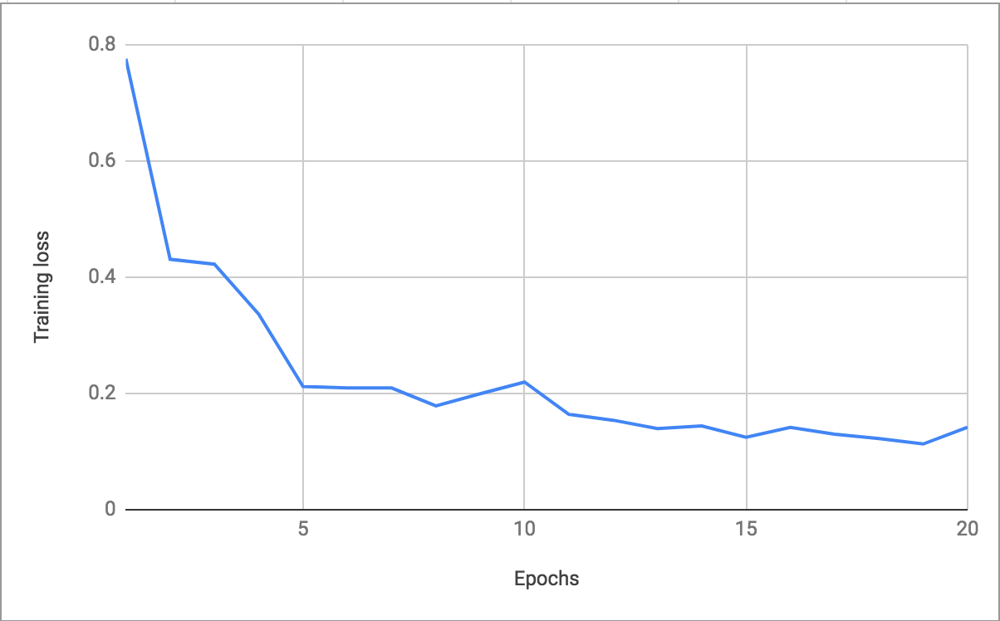
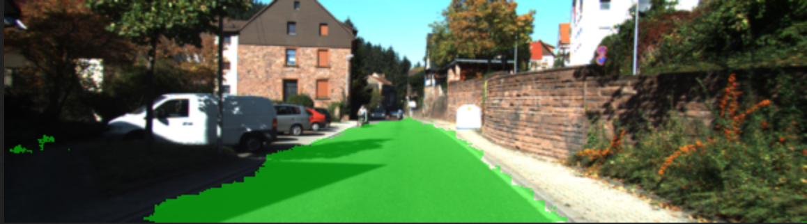
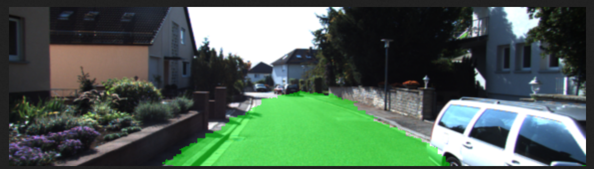

# Semantic Segmentation

## Introduction
This project aims at training a fully convolution neural network to segment 
drivable road area. 

## Architecture

The fully convolution neural network adopts 2 techniques:
- 1x1 Convolution
- Transpose Convolution
- Skip Connection

Our model is based on pre trained VGG-16 model. Output of layer 7, layer 4 and
layer 3 are taken out. Then 1x1 convolution is applied to each of them to reduce
depth to num_classes. Upsampling and skip connection are applied afterwards and
bring the dimension back to original image size.  

## Training

The model is trained for 20 epochs with `learning rate = 1e-3` and 
`keep probability = 0.5`.

The loss is shown as below: 

  
   
  <em>Figure 1: Training Loss</em>

## Segmentation Result
The segmentation results are stored in `run` folder.

Some samples are shown as below:

  
   
  <em>Figure 2: Example Image 1</em>

  
   
  <em>Figure 3: Example Image 2</em>

